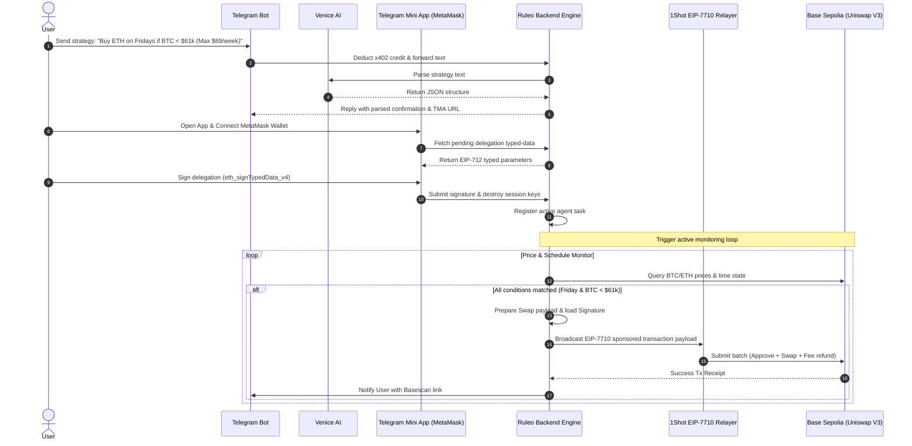

# Ruleo — Zero-Trust DeFi Autopilot Agent

<div align="center">


[](https://www.typescriptlang.org/)
[](https://docs.metamask.io/smart-accounts-kit/)
[](https://relayer.1shotapi.dev)
[](https://uniswap.org/)
[](#license)


[Live TMA Demo](https://f38326ae29c457.lhr.life) • [Quick Start](#-installation--quick-start) • [Architecture](#-architecture) • [Security Model](#-zero-custody-security-model) • [Contact](#-contact)

**Turn plain-English trading strategies into secure, on-chain autonomous agents with zero private-key exposure.**

A non-custodial automation suite built using the MetaMask Smart Accounts Kit, Venice AI, and the 1Shot gasless relayer.

</div>

---

## ✨ Features

- **Non-Custodial Delegations** — No private keys are ever stored or exposed on the backend database. Users sign standard ERC-7715 delegations locally.
- **Natural Language Parsing** — Compile English rules (e.g. *"buy $50 ETH weekly"*) into structured parameters using Venice AI / Groq Llama-3.3-70b.
- **Deterministic Cryptographic Caveats** — Pure, deterministic mapping of intent to smart contract boundaries:
  - **Spending Limits** (e.g. Capped to $69/week)
  - **Temporal Schedules** (e.g. Executing only on Fridays)
  - **Price Floors & Ceilings** (e.g. Checking Chainlink oracle price boundaries like BTC < $61,000)
- **x402 Micropayments Billing** — Integrates a gasless virtual credit ledger to sponsor AI compilation cycles.
- **Uniswap V3 Auto-Routing** — Dynamically queries multi-tier fee pools to lock in optimal swap rates on Base Sepolia.
- **1Shot EIP-7710 Multi-Leg Execution** — Broadcasts gas-abstracted EIP-7710 delegated batches (ERC-20 approvals + swaps + gas-reimbursement) in a single transaction.

---

## 🏗️ Architecture

Ruleo leverages a decentralized intent pipeline to bridge natural language instructions with cryptographically enforced smart accounts:



---

## 📂 Project Structure

```
vibecode/
├── public/                 // Glassmorphic Mini App client
│   ├── index.html          // Main viewport and UI layout
│   ├── app.js              // MetaMask EIP-712 signer integration
│   └── style.css           // Theme styling, layouts & animations
├── src/
│   ├── metamask/
│   │   ├── smart-account.ts // Counterfactual hybrid wallet initializer
│   │   └── delegation.ts    // ERC-7715 caveat mapper
│   ├── relayer/
│   │   └── one-shot.ts      // Uniswap V3 pathfinder & 1Shot broadcaster
│   └── webhooks/
│       └── oneshot-webhook.ts // Status event callback listener
├── a2a-coordinator.ts      // Core monitoring scheduler & transaction trigger
├── agent-wallet.ts         // Virtual balance ledgers & x402 billing logic
├── caveat-generator.ts     // Converts strategy schema to ERC-7715 caveats
├── formatter.ts            // Bot text visual format utility
├── index.ts                // Main express server & Telegraf runner
├── llm-parser.ts           // Venice/Groq LLM completion compiler
├── rule-schema.ts          // Zod structures definition
├── validator.ts            // Semantic compiler validation rule checks
├── tsconfig.json           // TS compilation config
└── package.json            // Manifest and dependencies
```

---

## 🔒 Zero-Custody Security Model

Traditional autonomous agents require you to share your private keys or seed phrases with the cloud backend to execute trades on your behalf. **Ruleo completely eliminates this attack vector.**

1. **Counterfactual Addressing**: A unique smart account address is derived natively using your EOA. No transactions are initialized until deployment.
2. **Cryptographic Caveats**: You sign a specific, time-bounded permission delegation containing rules (e.g. *you only allow swaps on Uniswap V3, only up to $69, and only on Base Sepolia*).
3. **No Key Storage**: The backend stores the signature (`signedDelegation`) and the caveats. The backend cannot call arbitrary functions, steal your tokens, or run unapproved transactions.

---

## 🚀 Installation & Quick Start

### 1. Clone the repository

```bash
git clone https://github.com/debojyoti10CC/Ruleo.git
cd Ruleo
npm install
```

### 2. Configure Environment

Create a `.env` file in the root directory (or copy the example):

```bash
cp .env.example .env
```

Fill in your respective API keys:
- `BOT_TOKEN`: Your bot credentials from `@BotFather`
- `GROQ_API_KEY` or `VENICE_API_KEY`: Model inference key for compilation
- `PRIVATE_KEY`: A temporary sponsorship gas wallet address

### 3. Spin up local development server

```bash
npm run dev
```

### 4. Expose the server tunnel (For Telegram Mini App)

Since Telegram requires HTTPS to load Mini Apps, run a local tunnel to port `3000`:

```bash
ssh -o StrictHostKeyChecking=no -R 80:localhost:3000 nokey@localhost.run
```

Update your `.env`'s `TUNNEL_URL` parameter with the allocated domain and restart the server.

---

## ⚙️ How It Works (Caveat Setup)

Below is how the parsed text rules map to strict ERC-7715 constraints under the hood:

| User Intent | Mapped Caveat Type | Enforced Parameters |
| :--- | :--- | :--- |
| **Max $69/week** | `erc20-token-periodic` | Period Duration: `604800s`, Allowance: `69.00 USDC` |
| **Only on Fridays** | `temporal` | Day constraint: `friday`, Expiry timestamp calculated |
| **BTC < $61,000** | `price-condition` | Asset: `BTC`, Condition: `priceBelow = 61000` |

---

## 🏆 Hackathon Tracks & Code Usage

This section provides direct code references for the hackathon tracks we are applying for.

### 🦊 MetaMask Smart Accounts Kit Usage

Ruleo uses MetaMask Smart Accounts (Hybrid/Stateless EIP-7702 smart account contracts) to build non-custodial trading agents.

*   **Delegations**
    *   **Creating Delegations:** Delegations are configured with target contract permissions and periodic allowance limits via the `createDelegation` method in [index.ts#L460-L483](file:///c:/Users/Debojyoti%20De%20Majumde/vibecode/index.ts#L460-L483).
    *   **Redeeming Delegations:** The delegation is signed by the owner via MetaMask SDK's `eth_signTypedData_v4` in [public/app.js#L390-L403](file:///c:/Users/Debojyoti%20De%20Majumde/vibecode/public/app.js#L390-L403). It is then submitted as the execution permission context inside `executeTrade` to the 1Shot Relayer in [src/relayer/one-shot.ts#L360-L400](file:///c:/Users/Debojyoti%20De%20Majumde/vibecode/src/relayer/one-shot.ts#L360-L400).
*   **Advanced Permissions**
    *   *Requesting Advanced Permissions:* Not Used (Standard EIP-7715 delegations are used to restrict contract actions and token allowances).
    *   *Redeeming Advanced Permissions:* Not Used.
*   **Redelegations**
    *   *Creating Redelegation:* Not Used.
*   **x402 Micropayments**
    *   **Server Logic:** The server charges virtual x402 credit for AI model compilation using `deductX402Fee` in [agent-wallet.ts#L75-L101](file:///c:/Users/Debojyoti%20De%20Majumde/vibecode/agent-wallet.ts#L75-L101). Micropayments are triggered during user rule parsing ([index.ts#L184](file:///c:/Users/Debojyoti%20De%20Majumde/vibecode/index.ts#L184), [index.ts#L271](file:///c:/Users/Debojyoti%20De%20Majumde/vibecode/index.ts#L271)) and execution status webhook callback updates ([index.ts#L661](file:///c:/Users/Debojyoti%20De%20Majumde/vibecode/index.ts#L661), [index.ts#L693](file:///c:/Users/Debojyoti%20De%20Majumde/vibecode/index.ts#L693)).
    *   **Client Usage:** The client signs delegations gaslessly in [public/app.js#L390-L403](file:///c:/Users/Debojyoti%20De%20Majumde/vibecode/public/app.js#L390-L403) and initiates registration via `/api/deploy` in [index.ts#L525-L603](file:///c:/Users/Debojyoti%20De%20Majumde/vibecode/index.ts#L525-L603).

---

### ⚡ 1Shot API Usage

All autonomous, non-custodial executions are broadcast gas-abstracted through the 1Shot Relayer.

*   **Capabilities & Estimation:** We query supported chain capabilities and estimate fee amounts dynamically:
    *   `relayer_getCapabilities`: [src/relayer/one-shot.ts#L297](file:///c:/Users/Debojyoti%20De%20Majumde/vibecode/src/relayer/one-shot.ts#L297)
    *   `relayer_estimate7710Transaction`: [src/relayer/one-shot.ts#L380](file:///c:/Users/Debojyoti%20De%20Majumde/vibecode/src/relayer/one-shot.ts#L380)
*   **Transaction Broadcast & Status:** We submit the EIP-7710 execution payload and track its transaction receipt:
    *   `relayer_send7710Transaction`: [src/relayer/one-shot.ts#L396](file:///c:/Users/Debojyoti%20De%20Majumde/vibecode/src/relayer/one-shot.ts#L396)
    *   `relayer_getStatus`: [src/relayer/one-shot.ts#L408](file:///c:/Users/Debojyoti%20De%20Majumde/vibecode/src/relayer/one-shot.ts#L408)
*   **Webhook Listener:** Handles real-time transaction updates from the 1Shot Relayer:
    *   Webhook Route: [index.ts#L653-L718](file:///c:/Users/Debojyoti%20De%20Majumde/vibecode/index.ts#L653-L718)
    *   Webhook Handler: [src/webhooks/oneshot-webhook.ts](file:///c:/Users/Debojyoti%20De%20Majumde/vibecode/src/webhooks/oneshot-webhook.ts)

---

### 🎭 Venice AI Usage

Venice AI compiles trading strategies written in unstructured English into parameterized JSON rules.

*   **API Configuration:** Dynamically configured endpoint (`https://api.venice.ai/api/v1/chat/completions`) and model parameters (`llama-3.3-70b`) are declared in [llm-parser.ts#L7-L20](file:///c:/Users/Debojyoti%20De%20Majumde/vibecode/llm-parser.ts#L7-L20).
*   **Parser Call:** Strategy text is parsed to build structured intents via `parseRule` in [llm-parser.ts#L92-L138](file:///c:/Users/Debojyoti%20De%20Majumde/vibecode/llm-parser.ts#L92-L138).

---

### 💬 Feedback

We highly appreciate feedback on Ruleo! 
*   Please file feedback by opening an issue on the [Ruleo GitHub Issues Page](https://github.com/debojyoti10CC/Ruleo/issues).
*   Specific issue links:
    *   [Issue #1: General Feedback / Improvement Ideas](https://github.com/debojyoti10CC/Ruleo/issues)

---

### 🐦 Social Media (X)

Check out our updates and showcases on X:
*   **Project Launch / Demo Tweet:** [Link to tweet]()
*   **Walkthrough Video / Feature Showcase Tweet:** [Link to tweet]()

---

## 🤝 Contributing

We welcome contributions from the community to expand the boundaries of non-custodial automated trading.

1. **Fork** the repository.
2. Create your **feature branch** (`git checkout -b feature/CoolAutomation`).
3. **Commit** your changes (`git commit -m 'Add support for Limit orders'`).
4. **Push** to the branch (`git push origin feature/CoolAutomation`).
5. Open a **Pull Request**.

---

## 📞 Contact

** Ruleo Contributors**
* **Repository:** [debojyoti10CC/Ruleo](https://github.com/debojyoti10CC/Ruleo)

---

*Ruleo — DeFi Autopilot with Zero Custody* 🦊⚡
